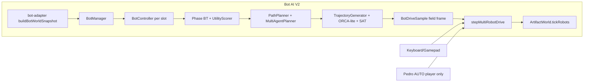
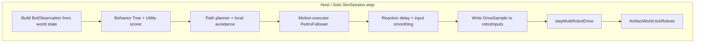
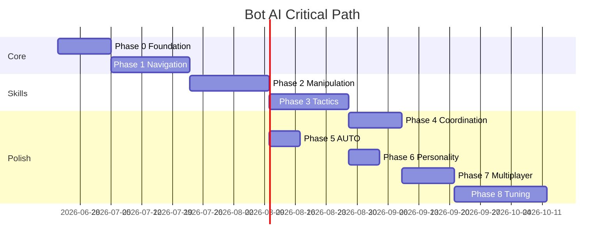

# AI Bot Development Plan — FTC DECODE Simulator

**Status:** In progress (Phases 0–7 implemented)  
**Last updated:** 2026-06-20  

This document is the authoritative plan for implementing **AI-controlled bots** in the FTC DECODE simulator. Bots should behave similarly to human players: semi-intelligent decision making, smooth movement and rotation, realistic reaction times, and support for both single-player and networked multiplayer matches.

Related docs: [MULTIPLAYER_MANIFEST.md](./MULTIPLAYER_MANIFEST.md), [ROADMAP.md](./ROADMAP.md).

---

## Table of contents

1. [Goals and definition of done](#1-goals-and-definition-of-done)
2. [Current integration surface](#2-current-integration-surface)
3. [Target architecture](#3-target-architecture)
4. [Behavioral design](#4-behavioral-design)
5. [Session integration](#5-session-integration)
6. [Implementation phases](#6-implementation-phases)
7. [Testing and validation](#7-testing-and-validation)
8. [Risks and mitigations](#8-risks-and-mitigations)
9. [Recommended build order](#9-recommended-build-order)
10. [UI / product touchpoints](#10-ui--product-touchpoints)
11. [Reuse vs build new](#11-reuse-vs-build-new)
12. [Summary](#12-summary)

---

## 1. Goals and definition of done

### Primary goals

| Goal | Success criteria |
|------|------------------|
| Human-like play | Smooth holonomic motion, believable reaction delays (150–400 ms), occasional recoverable mistakes |
| Competitive skill | Win ≥40% of matches vs intermediate human drivers in controlled benchmarks |
| Solo practice | Fill 1–3 unclaimed slots with configurable difficulty/alliance |
| Multiplayer | Host runs bots authoritatively; unclaimed slots auto-filled; no client-side bot sim |
| Rules fidelity | Respects launch zones, gate fouls, parking, motif scoring, ramp capacity |

### Definition of done

Bots are **not complete** until all of the following pass:

1. **Solo 2v2:** Human + 1 ally bot vs 2 opponent bots — bot alliance wins ≥35% over 50 matches at “Normal” difficulty.
2. **Solo 1v3:** Human vs 3 bots — human wins ≤70% at “Hard” (bots are credible opponents).
3. **Net host:** 2 humans + 2 bots in a LAN match — no desync, no input conflicts, stable 120 Hz tick.
4. **Regression:** Zero changes to scoring/collision outcomes when bots are disabled.
5. **Observability:** Per-bot debug overlay (intent, target, path, reaction timer) for tuning.

---

## 2. Current integration surface

**Bot AI V2 is implemented** in `@ftc-sim/bot` (see [BOT_AI_V2.md](./BOT_AI_V2.md)). `SimSession` and solo web practice both tick `BotManager` before `stepMultiRobotDrive`. NPC slots (`blue-near`, `red-far`, `red-near`) receive field-centric holonomic commands when bot slots are enabled.



### Key hooks

| System | File | Bot relevance |
|--------|------|---------------|
| Per-robot input buffer | `packages/session/src/sim-session.ts` — `applyInputFrame`, `robotInputs` | Bots write `DriveSample` here each tick |
| Drive resolution | `packages/session/src/drive-resolver.ts` | Player-only; bots bypass this |
| Motion execution | `packages/robot/src/multi-robot-drive.ts`, `velocity-drive.ts` | Same physics as humans |
| Path following | `packages/pedro/src/follower.ts` | Reuse PIDF holonomic follower for nav |
| Game state | `ArtifactWorld.getMatchState()`, `StateSnapshot` | Bot observations |
| Zones/geometry | `packages/mechanisms/src/geometry.ts`, `packages/season-decode/field.json` | Launch, gate, basin, ramp, BASE |
| NPC slots | `packages/session/src/match-robots.ts` | 3 claimable NPC IDs + alliance spawns |

### Sim constraints bots must respect

- Gates open on **OBB overlap** with gate zone — no button (`MechanismCommand.gate` is ignored).
- Shots require **launch zone** eligibility; speed scales with distance (`planShot` in `geometry.ts`).
- Intake needs front-edge contact + `intake ≥ 0.45`; max 3 stored artifacts.
- Teleop drive only when `matchSnap.allowsDrive`; AUTO mechanisms run in `auto`/`transition` for player only today.
- NPC mechanisms currently get `autoMechanisms: false` — bots need AUTO support added.

---

## 3. Target architecture

### 3.1 Package layout

Create **`packages/bot`** (`@ftc-sim/bot`) — headless, Vitest-tested, no React:

```
packages/bot/
├── src/
│   ├── index.ts
│   ├── types.ts              # BotConfig, BotObservation, BotAction, Difficulty
│   ├── controller/
│   │   ├── bot-controller.ts # Per-robot tick: observe → decide → act
│   │   └── bot-manager.ts    # All bots for a session; slot assignment
│   ├── perception/
│   │   ├── observation-builder.ts  # StateSnapshot/MatchState → BotObservation
│   │   └── threat-model.ts         # Opponent poses, contested zones
│   ├── cognition/
│   │   ├── behavior-tree/    # Phase-aware BT root
│   │   ├── utility/          # Target scoring, role selection
│   │   └── blackboard.ts     # Shared alliance state (2-bot coord)
│   ├── navigation/
│   │   ├── field-graph.ts    # Waypoint nav mesh (144×144 DECODE)
│   │   ├── path-planner.ts   # A* on graph + dynamic reroute
│   │   ├── local-avoidance.ts# ORCA-lite / potential field vs robots+barriers
│   │   └── motion-executor.ts# Wraps PedroFollower → HolonomicInput
│   ├── skills/
│   │   ├── intake-skill.ts
│   │   ├── shoot-skill.ts    # Align, launch-zone check, hold-fire
│   │   ├── gate-skill.ts     # Approach gate zone safely
│   │   ├── collect-skill.ts  # Spike rows, station, reserve
│   │   ├── park-skill.ts     # Endgame BASE
│   │   └── defend-skill.ts   # Block gate, shadow opponent
│   ├── personality/
│   │   ├── reaction-delay.ts # Per-action latency + jitter
│   │   ├── imperfection.ts   # Aim noise, hesitation, wrong-target recovery
│   │   └── difficulty.ts     # Easy/Normal/Hard parameter presets
│   └── auto/
│       └── auto-routines.ts    # Scripted AUTO paths (reuse Pedro sequences)
```

Wire into session via thin adapter in **`packages/session/src/bot-adapter.ts`** (keeps `@ftc-sim/bot` optional dependency).

### 3.2 Control flow (target)



**Design principle:** Separate **decide** (10–20 Hz, with reaction delay) from **act** (120 Hz motion tracking). Humans sample input every frame with smoothing in `drive-input-sampler.ts`; bots mirror this with `InputSmoother` using similar time constants.

### 3.3 Bot observation model

```typescript
interface BotObservation {
  tick: number;
  self: { id, alliance, pose, linear, angular, storage: StoredArtifact[] };
  allies: RobotSummary[];
  opponents: RobotSummary[];
  artifacts: { id, phase, pose, color, alliance? }[];
  match: { phase, timeRemaining, allowsDrive, controlSource };
  game: {
    motif: '21'|'22'|'23';
    rampOccupancy: Record<Alliance, boolean[]>;
    gateOpen: Record<Alliance, boolean>;
    scores: { blue, red };
    fouls: FoulsSummary;
  };
  field: { barriers: Polygon[]; zones: FieldZones };
}
```

Build from `SimSession.getState()` internally (full fidelity) or `StateSnapshot` for tests — **never** require the bot to run Rapier or read DOM.

### 3.4 Action model

Maps 1:1 to existing `DriveSample`:

```typescript
interface BotAction {
  drive: HolonomicInput;
  driveFrame: 'field' | 'robot';
  mechanism: { intake?: number; shoot?: boolean };
  shootEdge?: boolean;
  shootHeld?: boolean;
}
```

---

## 4. Behavioral design

### 4.1 High-level behavior tree (teleop)

Phase-root selector with parallel awareness:

| Phase | Primary behaviors |
|-------|-------------------|
| **AUTO** (30s) | Alliance-specific Pedro routine OR heuristic: preload shoot → leave zone → park prep |
| **TRANSITION** | Hold position / finish last shot |
| **TELEOP early** (120–61s) | Collect spikes → score cycles → motif alignment |
| **TELEOP mid** (60–21s) | Gate decisions, overflow management, contest opponent ramp |
| **TELEOP endgame** (≤20s) | BASE parking, contact foul avoidance, ally coordination |

**Utility-scored tasks** (pick highest utility × role weight):

| Task | Utility inputs |
|------|----------------|
| Collect nearest spike | Distance, path cost, opponent proximity, storage fullness |
| Score loaded artifacts | Ramp free slots, launch zone distance, alignment error |
| Gate own ramp | Motif mismatch count, overflow pressure, time remaining |
| Defend opponent gate | Opponent near their gate + our ramp full |
| Block opponent collector | Opponent path to artifact cluster |
| Park BASE | `timeRemaining ≤ 20`, distance to BASE, ally parked status |

### 4.2 Navigation and pathfinding

**No grid pathfinding exists today.** Implement a hybrid stack:

1. **Static waypoint graph** (~40–60 nodes) from `field.json` zones:
   - Launch corners, spike rows, station, reserve approach, goal approach points, gate approach (safe standoff), BASE centers, tunnel avoidance waypoints.
   - Edges weighted by distance + penalty for opponent gate zones (foul risk).

2. **Global planner:** A* on graph, replan every 0.5–1.0 s or on blockage.

3. **Local executor:** `PedroFollower`-style PID on polyline from graph path; reuse `packages/pedro/src/follower.ts` via `motion-executor.ts`.

4. **Local avoidance (120 Hz):**
   - Robot–robot: repulsion + velocity obstacle (reuse SAT from `barrier-collision.ts` patterns).
   - Barriers: slide along SAT resolution normals.
   - Artifacts on field: small tangential bias (don’t plow through clusters unless intake active).

5. **Stuck recovery:** If displacement < 2″ over 1.5 s → backoff + rotate + replan.

### 4.3 Intake and artifact management

| Sub-skill | Logic |
|-----------|--------|
| **Spike collection** | Prioritize alliance-side rows (`getMatchArtifactStaging`); approach with heading toward artifact; intake on when within 8″ and aligned |
| **Station/reserve** | Teleop-only reserve; station during auto+teleop |
| **Storage policy** | Prefer scoring order: motif-matching colors first, then overflow candidates |
| **Full storage** | Transition to shoot skill immediately |

### 4.4 Shooting (close and long range)

Reuse `planShot()` physics awareness:

| Range | Strategy |
|-------|----------|
| **Close** (<30″ to basin) | Short alignment window, single `shootEdge`, higher speed tolerance |
| **Medium** (30–70″) | Field-centric strafe to launch zone centroid, heading lock, `shootHeld` burst |
| **Long** (>70″) | Drive to optimal launch polygon vertex first; verify `robotInLaunchZone` before fire |

**Aim controller:** Rotate to basin centroid bearing; add difficulty-scaled heading error (±2–8°). **Recovery:** Miss / no ramp slot → reposition, don’t spam shots.

### 4.5 Gate usage

| Scenario | Behavior |
|----------|----------|
| **Beneficial release** | Ramp ≥6/9 occupied OR motif misalignment ≥3 balls → path into own gate zone |
| **Avoid foul** | Hard geofence around opponent gate zone unless `defend` utility exceeds foul cost (Hard only) |
| **Post-release** | Exit south, resume collection |

### 4.6 Offensive and defensive play

**Offensive:**

- Contest artifact-rich zones (spike seams).
- Shadow opponent collector (within 18″, block path, no intentional ram — avoid G425 tunnel fouls).
- Pressure opponent ramp when ahead on score (defensive gate camp).

**Defensive:**

- Ally role split: one scorer, one defender (utility `roleAssignment` on blackboard).
- BASE zone denial in endgame only when rules allow (avoid G427/G428).

### 4.7 Teammate coordination (2-bot alliance)

Shared **`AllianceBlackboard`** on `BotManager`:

| Signal | Use |
|--------|-----|
| `claimedSpikeRows` | Avoid duplicate collection |
| `rampIntent` | One bot gates while other collects |
| `parkReservation` | Split BASE full vs partial if only one can make it |
| `motifNeed` | Color requests (“need green for slot 4”) |

Coordination runs at 5 Hz; no direct communication to humans.

### 4.8 Human-like imperfections

| Parameter | Easy | Normal | Hard |
|-----------|------|--------|------|
| Reaction delay (ms) | 350–550 | 200–400 | 120–250 |
| Aim error (°) | ±8 | ±4 | ±2 |
| Replan hesitation | 25% | 10% | 3% |
| Wrong-target rate | 8% | 3% | 1% |
| Input smoothing τ | 0.12 s | 0.08 s | 0.05 s |

Implement in `personality/reaction-delay.ts` — queue intended actions, release after sampled delay.

---

## 5. Session integration

### 5.1 Solo mode

In `apps/web/src/App.tsx` / `usePhysicsRobot.ts`:

1. Add lobby UI: per-slot **Human | Bot (Easy/Normal/Hard) | Empty**.
2. `BotManager` instantiated with session; ticks inside `SimSession.step()` **before** `stepMultiRobotDrive`.
3. Unclaimed practice NPCs default to bot if enabled.

### 5.2 Multiplayer (host-authoritative)

In `apps/match-server/src/index.ts`:

| Rule | Implementation |
|------|----------------|
| Bots run **only on host** | `BotManager.tick()` in server tick loop |
| Slot priority | Human claim > Bot > Empty (parked at `-64,-64`) |
| No bot `InputFrame` from clients | Ignore client input for bot-controlled slots |
| Snapshots | Optional `botDebug` field in `StateSnapshot` (host-only overlay) |

Add **`HostRoomSettings`** fields:

```typescript
botSlots?: Record<ClaimableRobotId, { enabled: boolean; difficulty: Difficulty }>;
```

Protocol bump in `@ftc-sim/net` (v2 or optional extension).

### 5.3 AUTO phase for bots

Extend `sim-session.ts` NPC mechanism path so bots receive `autoMechanisms: true` when their AUTO routine is active (today NPCs always pass `false` in `buildRobotMechanismTick`).

Each bot gets `AutoRoutine` from `@ftc-sim/bot/auto` (mirrored Pedro paths or lightweight heuristic).

### 5.4 `resolveDriveInput` extension (optional)

Add `'bot'` to `ControlSource` in `@ftc-sim/match` **or** keep bots entirely on the NPC input path (simpler, less invasive). **Recommended:** NPC input path only — avoids touching player Pedro/auto logic.

---

## 6. Implementation phases

### Phase 0 — Foundation (1–2 weeks)

**Deliverables:**

- `packages/bot` scaffold + Vitest harness
- `BotObservation` builder from `SimSession.getState()`
- `BotController` writes `DriveSample` to a test session
- Headless sim test: bot drives forward 24″ without tunneling

**Exit criteria:**

- Unit tests for observation builder (100% zone coverage)
- Integration test: 1 bot slot moves in solo teleop

---

### Phase 1 — Navigation core (2–3 weeks)

**Deliverables:**

- DECODE waypoint graph + A*
- `MotionExecutor` wrapping `PedroFollower`
- Local avoidance vs barriers + robots
- Stuck recovery FSM

**Exit criteria:**

- Bot navigates spawn → blue spike row → return in <15 s, 0 barrier violations
- 100 randomized barrier layouts (session barriers) — success rate ≥95%

---

### Phase 2 — Manipulation skills (2–3 weeks)

**Deliverables:**

- Intake skill (front-edge alignment)
- Shoot skill (close/medium/long tiers)
- Storage manager (motif-aware)
- Gate skill (safe entry/exit)

**Exit criteria:**

- Solo bot scores ≥6 classified + handles overflow in 2 min infinite teleop
- Shot success: ≥70% classified at Normal difficulty from standard launch points

---

### Phase 3 — Tactical brain (2–3 weeks)

**Deliverables:**

- Behavior tree + utility scorer
- Phase-aware strategy (early/mid/endgame)
- Offensive/defensive utilities
- Mistake recovery (replan, backoff, abandon contested target)

**Exit criteria:**

- Bot beats **scripted idle opponent** (stationary NPCs) by ≥50 pts in full match
- Bot beats **greedy collector** baseline (collect only, no shoot) by ≥30 pts

---

### Phase 4 — Alliance coordination (1–2 weeks)

**Deliverables:**

- `AllianceBlackboard`
- Role assignment (scorer/defender)
- 2-bot deconfliction on spikes and gate

**Exit criteria:**

- 2-bot alliance beats 2 independent bots by ≥15% win rate
- No duplicate gate triggers from both bots within 2 s unless intentional

---

### Phase 5 — AUTO routines (1 week)

**Deliverables:**

- Mirrored Pedro auto sequences per alliance/spawn (`pathChainForAlliance`)
- Heuristic fallback if no path loaded
- LEAVE + preload handling

**Exit criteria:**

- Bot AUTO scores within 20% of bundled `decode-auto.pp` human-tuned run
- LEAVE consistently achieved

---

### Phase 6 — Personality and difficulty (1 week)

**Deliverables:**

- Reaction delay, aim noise, smoothing
- Easy / Normal / Hard presets
- UI selectors (solo + host lobby)

**Exit criteria:**

- Blind test: 3 humans rank Easy < Normal < Hard correctly ≥80% of the time

---

### Phase 7 — Multiplayer integration (1–2 weeks)

**Deliverables:**

- Host `BotManager` in match-server tick loop
- Slot assignment vs human claims
- Protocol/settings for bot slots
- Debug overlay (host + solo)

**Exit criteria:**

- LAN 2H+2B match completes with stable scores
- No regression in human-only multiplayer tests

---

### Phase 8 — Competitive tuning (ongoing, 2–4 weeks)

**Deliverables:**

- Benchmark suite + ELO-style tracking
- Parameter tuning from recorded human telemetries (optional: export via extended `__ftcSim`)
- Balance patches

**Exit criteria:** Definition of done (Section 1) met.

---

## 7. Testing and validation

### 7.1 Test pyramid

| Layer | What | Where |
|-------|------|-------|
| **Unit** | Graph search, utility math, observation, reaction delay | `packages/bot/**/*.test.ts` |
| **Skill** | Intake alignment, shot from fixture poses | Headless `SimSession` scenarios |
| **Integration** | Full match bot vs baselines | `packages/bot/e2e/` |
| **Multiplayer** | Host + join clients, bot slots | `apps/match-server` Vitest + manual LAN |
| **Human playtest** | Structured sessions | QA checklist |

### 7.2 Benchmark scenarios

| ID | Scenario | Pass metric |
|----|----------|-------------|
| B1 | Navigation gauntlet (spawn → 5 waypoints) | <20 s, 0 stuck >3 s |
| B2 | Intake 9 spikes → score all | ≥7 classified in 120 s |
| B3 | Long-range scoring only | ≥5 classified from far launch |
| B4 | Gate decision | Opens when ramp full; avoids opponent gate |
| B5 | Endgame park | BASE full or partial per time budget |
| B6 | Full match vs idle | Win ≥80% |
| B7 | Full match vs greedy bot | Win ≥60% |
| B8 | 2v2 coordinated | ≥35% win vs 2 independent Hard bots |
| B9 | Human benchmark | Section 1 win-rate targets |

### 7.3 Regression guards

- Run existing Vitest suites in `packages/session`, `packages/robot`, `packages/mechanisms` on every PR.
- **Bot-off parity test:** Same seed match with bots disabled vs pre-bot baseline — scores identical.
- **Core sim protection policy** from [MULTIPLAYER_MANIFEST.md](./MULTIPLAYER_MANIFEST.md) §4: no changes to Rapier step order, SAT collision, or rules engine for bot convenience.

### 7.4 Observability

| Tool | Purpose |
|------|---------|
| Field overlay | Planned path, current skill, utility bars |
| `__ftcSim` extension | `getBotDebug(robotId)`, `setBotDifficulty` |
| Match replay log | JSONL: observation → action per bot tick (for tuning) |

---

## 8. Risks and mitigations

| Risk | Impact | Mitigation |
|------|--------|------------|
| Bot compute at 120 Hz × 3 robots | Host CPU | Decide at 15 Hz; act at 120 Hz; share one planner thread |
| Gate foul accidents | Major −15 | Opponent gate geofence; utility penalty |
| Shot model mismatch (straight-line) | Missed shots | Calibrate aim tables empirically; don’t assume ballistic |
| Multi-robot collision deadlocks | Stuck bots | Stuck FSM + low-speed separation pass |
| Human input conflict on bot slot | Desync | Slot lock: bot OR human, never both |
| Pedro follower tuned for AUTO only | Jerky teleop nav | Separate follower constants for bot nav |
| `onlyClaimedRobots` net mode | Bots at `-64,-64` | Auto-enable bot on unclaimed slot at match init |

---

## 9. Recommended build order



Phases 5 and 6 can overlap with 4 once Phase 2 is done.

---

## 10. UI / product touchpoints

| Surface | Change |
|---------|--------|
| Solo spawn screen | Bot count, difficulty, alliance assignment |
| Host lobby (`LobbyScreen.tsx`) | Per-slot Human/Bot/Empty |
| Match overlay | Optional bot intent debug (dev flag) |
| README | Link to this doc when implementation starts |

---

## 11. Reuse vs build new

| Reuse | Build new |
|-------|-----------|
| `PedroFollower` PID motion | Waypoint graph + A* |
| `stepMultiRobotDrive` physics | Behavior tree + utility AI |
| `DriveSample` / `InputFrame` contract | Observation builder |
| `geometry.ts` zone helpers | Alliance blackboard |
| `AutoSequenceRunner` for AUTO | Reaction/personality layer |
| `SimSession` tick hook | Bot manager + session adapter |

---

## 12. Summary

The lowest-risk path is a **headless `@ftc-sim/bot` package** that outputs the same `DriveSample` structures humans already produce, running **authoritatively on the host** at decide-rate and **every physics tick** at act-rate. Reuse **Pedro’s follower** for smooth motion, add a **field waypoint graph** for global nav, and layer **utility-based tactics** with **reaction delays** for believable play. Solo and multiplayer share one brain; only slot assignment differs.

**Bots are not complete** until they pass the human-competitive benchmarks in Section 1 in both solo 2v2 and hosted online matches, with full regression parity when disabled.

**Next step:** Phase 0 — package scaffold + session hook + first moving bot.
