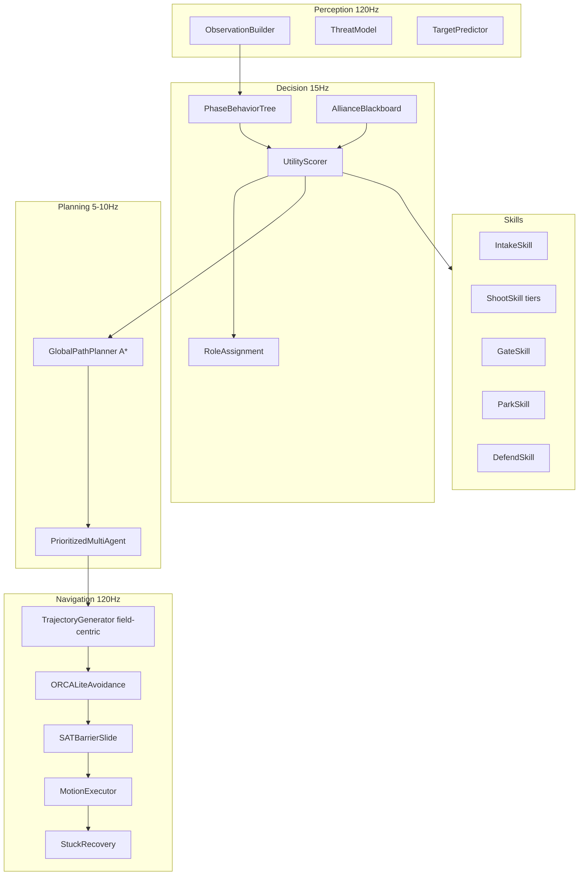

# Bot AI V2 — Technical Design

**Status:** Implemented  
**Package:** `@ftc-sim/bot`  
**Last updated:** 2026-06-20  

Bot AI V2 replaces the Phase 0–1 priority-rule stack with a field-centric, layered architecture: utility-scored behavior tree for strategy, enhanced waypoint-graph global planning with prioritized multi-agent coordination, ORCA-lite + SAT local avoidance, modular skills, and benchmark gates.

Related: [BOT_AI.md](./BOT_AI.md) (original plan and win-rate targets).

---

## Architecture

---

## Module layout

| Path | Responsibility |
|------|----------------|
| `packages/session/src/bot-adapter.ts` | Sole `BotWorldSnapshot` builder (session + web) |
| `controller/bot-controller.ts` | Per-robot tick orchestrator |
| `controller/bot-manager.ts` | Multi-slot lifecycle + PP coordination |
| `cognition/behavior-tree/` | Phase-aware task selection via `decideTask()` |
| `cognition/utility/scorer.ts` | Utility features for collect/score/gate/defend/park |
| `cognition/blackboard.ts` | Claims, roles, rampIntent, motifNeed, parkReservation |
| `navigation/trajectory-generator.ts` | Field-centric pure pursuit + accel limits |
| `navigation/local-avoidance.ts` | ORCA-lite multi-robot |
| `navigation/barrier-avoidance.ts` | SAT slide on session barriers |
| `navigation/multi-agent-planner.ts` | Prioritized Planning corridor penalties |
| `skills/*.ts` | Intake, shoot (3 tiers), gate, park, defend |
| `personality/imperfection.ts` | Utility noise, hesitation, aim error |
| `auto/auto-routines.ts` | Pedro AUTO paths (robot frame during AUTO only) |
| `benchmarks/` | B1–B9 integration tests |

---

## Field-centric drive

All teleop bot commands use `driveFrame: 'field'` (`forward` = +Y field, `strafe` = +X field), matching human teleop defaults in `sim-session.ts`. AUTO routines use Pedro in `driveFrame: 'robot'` until teleop begins.

---

## Decision framework

Hybrid **phase behavior tree + utility AI**:

- `ParkEndgame` when `timeRemaining <= 25s`
- `AutoPhase` during AUTO/transition
- Teleop: utility-ranked collect / score / gate / defend / park / idle

Task commitment: lock navigation goal + blackboard claim until completion, stuck timeout, or utility override (Δ > 0.25).

---

## Difficulty presets

| Parameter | easy (Beginner) | normal | hard (Competitive) |
|-----------|-----------------|--------|---------------------|
| Reaction delay | 350–550 ms | 200–400 ms | 120–250 ms |
| Aim error | ±8° | ±4° | ±2° |
| Utility noise | ±0.15 | ±0.08 | ±0.03 |
| Defend/contest | off | off | on |

---

## Benchmarks

| ID | Test file | Pass criteria |
|----|-----------|---------------|
| B1 | `benchmarks/navigation-gauntlet.test.ts` | ≥75% goals reached |
| B2–B7 | `benchmarks/match-benchmarks.test.ts` | Session integration proxies |
| B8 | `benchmarks/navigation-gauntlet.test.ts` | No NaN at 120 Hz × 4s |
| B9 | `packages/session/src/bot-regression.test.ts` | Bots disabled → identical hash |

Win-rate targets from BOT_AI §1 remain tuning goals for Phase 7 competitive playtests.

---

## Integration

1. `SimSession.step()` — `buildBotWorldSnapshot()` → `BotManager.tick()` → `botSampleToDriveSample()` → `stepMultiRobotDrive`
2. Solo web — `buildBotWorldSnapshotFromWebContext()` in `usePhysicsRobot.ts`
3. Host multiplayer — bots host-only via `SimSession.setBotSlots()` (match-server env-gated fill optional)

---

## Deleted / replaced from V1

- Flat `selectTask()` priority chain → `decideTask()` + utility scorer
- Centroid repulsion → ORCA-lite + SAT
- Robot-frame Pedro teleop nav → field-centric trajectory generator
- Monolithic `mechanism-skill.ts` → modular skills
- Duplicate snapshot in web → unified `bot-adapter.ts`
